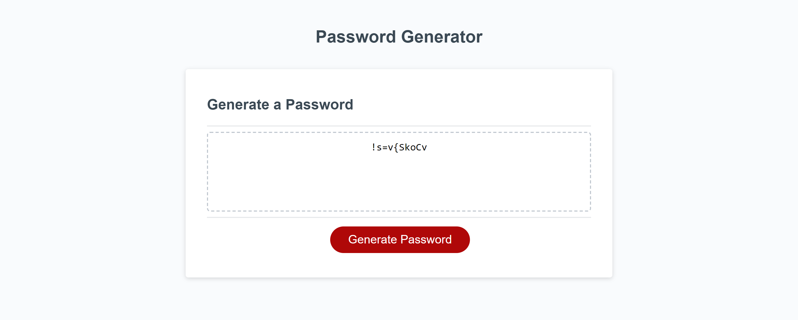

# JN-Password-Generator

## Description

Through this challenge, I was able to modify a starter code to crate a random password generator. This page allows uesrs to generate a password by going through a series of prompts and selecting the criteria that they want their password to contain. The generator will return a password containing all of the criteria that the user chose while going through the prompts. The project was completed by following the acceptance criterias below:

```
GIVEN I need a new, secure password
WHEN I click the button to generate a password
THEN I am presented with a series of prompts for password criteria
WHEN prompted for password criteria
THEN I select which criteria to include in the password
WHEN prompted for the length of the password
THEN I choose a length of at least 8 characters and no more than 128 characters
WHEN asked for character types to include in the password
THEN I confirm whether or not to include lowercase, uppercase, numeric, and/or special characters
WHEN I answer each prompt
THEN my input should be validated and at least one character type should be selected
WHEN all prompts are answered
THEN a password is generated that matches the selected criteria
WHEN the password is generated
THEN the password is either displayed in an alert or written to the page
```

This challenege has shown me much about JavaScript and how I can make or add changes to the webpage. I have learned how to use variables and functions, as well as other methods, in order to add the options chosen by the user and generate a password based on their selections. 

## Usage

I was given starter code for this project. The CSS and JS files were attached to the HTML. From there, I was able to add my own code to get the page to generate a random password. The image below shows how the final product appears after going through the prompts and generating a random password:



## Credits

Thank you, Corey Yates and Michael Hodges for all your help! 😁

## Links

GitHub Repository Link: https://github.com/jkimys2/JN-Password-Generator

Deployed Application: 